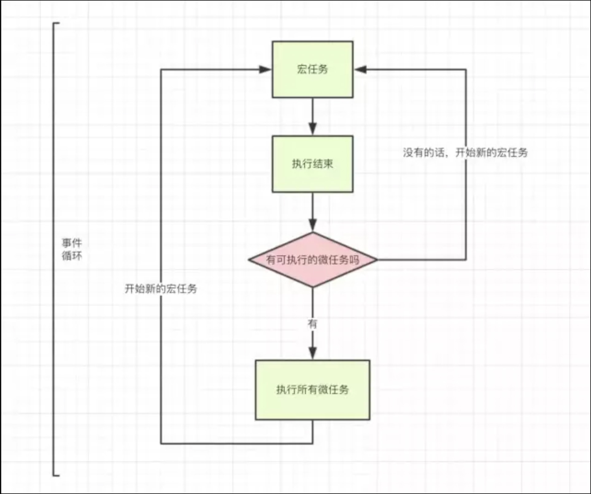

#### js执行机制


举例：
```
console.log('1');

setTimeout(function() {
    console.log('2');
    process.nextTick(function() {
        console.log('3');
    })
    new Promise(function(resolve) {
        console.log('4');
        resolve();
    }).then(function() {
        console.log('5')
    })
})
process.nextTick(function() {
    console.log('6');
})
new Promise(function(resolve) {
    console.log('7');
    resolve();
}).then(function() {
    console.log('8')
})

setTimeout(function() {
    console.log('9');
    process.nextTick(function() {
        console.log('10');
    })
    new Promise(function(resolve) {
        console.log('11');
        resolve();
    }).then(function() {
        console.log('12')
    })
})
```

1. 第一轮事件循环流程分析如下：
* 整体script作为第一个宏任务进入主线程，遇到console.log，输出1。
* 遇到setTimeout，其回调函数被分发到宏任务Event Queue中。我们暂且记为setTimeout1。
* 遇到process.nextTick()，其回调函数被分发到微任务Event Queue中。我们记为process1。
* 遇到Promise，new Promise直接执行，输出7。then被分发到微任务Event Queue中。我们记为then1。
* 又遇到了setTimeout，其回调函数被分发到宏任务Event Queue中，我们记为setTimeout2。
* 第一轮事件循环宏任务执行结束，我们发现了process1和then1两个微任务。
* 执行process1,输出6。
* 执行then1，输出8。
* 第一轮事件循环正式结束
输出1，7，6，8

2. 第二轮时间循环从setTimeout1宏任务开始：
* 首先输出2。接下来遇到了process.nextTick()，同样将其分发到微任务Event Queue中，记为process2。new Promise立即执行输出4，then也分发到微任务Event Queue中，记为then2。
* 第二轮事件循环宏任务结束，我们发现有process2和then2两个微任务可以执行。
* 输出3。
* 输出5。
* 第二轮事件循环结束，第二轮输出2，4，3，5。

3. 第三轮事件循环开始，此时只剩setTimeout2了，执行。
* 直接输出9。
* 将process.nextTick()分发到微任务Event Queue中。记为process3。
* 直接执行new Promise，输出11。
* 将then分发到微任务Event Queue中，记为then3
* 第三轮事件循环宏任务执行结束，执行两个微任务process3和then3。
* 输出10。
* 输出12。
* 第三轮事件循环结束，第三轮输出9，11，10，12。