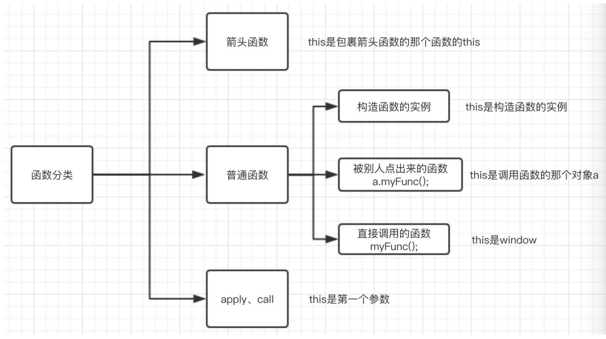

1. 对于直接调⽤的函数来说，不管函数被放在了什么地⽅，this都是window
2. 对于被别⼈调⽤的函数来说，被谁点出来的，this就是谁 
3. 在构造函数中，类中(函数体中)出现的this.xxx=xxx中的this是当前类的⼀个实例
4. call、apply时，this是第⼀个参数。bind要优与call/apply哦，call参数多，apply参数少 
5. 箭头函数没有⾃⼰的this，需要看其外层的是否有函数，如果有，外层函数的this就是内部箭头函数 的this，如果没有，则this是window